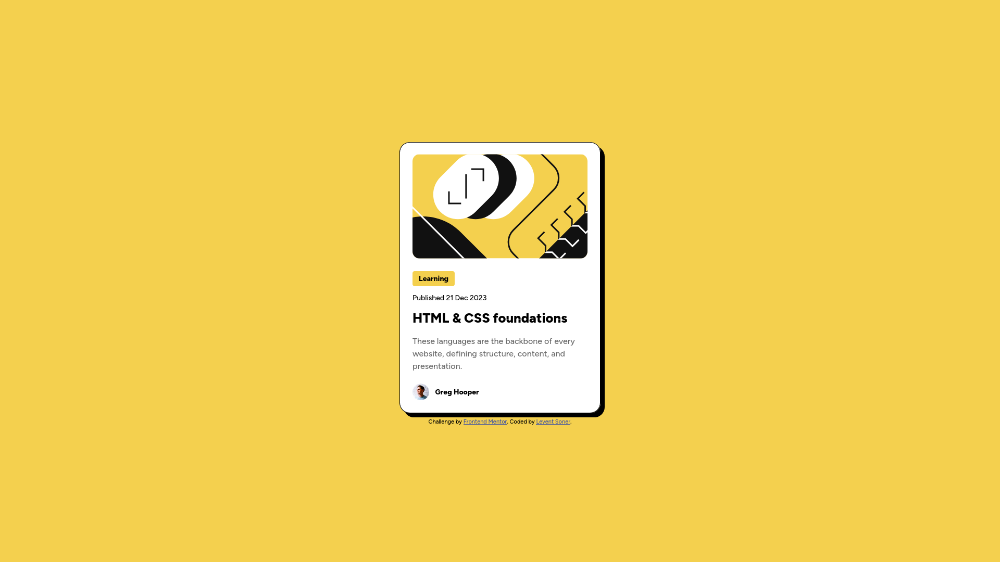

# Frontend Mentor - Blog preview card solution

This is a solution to the [Blog preview card challenge on Frontend Mentor](https://www.frontendmentor.io/challenges/blog-preview-card-ckPaj01IcS). Frontend Mentor challenges help you improve your coding skills by building realistic projects. 

## Table of contents

- [Overview](#overview)
  - [The challenge](#the-challenge)
  - [Screenshot](#screenshot)
  - [Links](#links)
- [My process](#my-process)
  - [Built with](#built-with)
  - [What I learned](#what-i-learned)
  - [Useful resources](#useful-resources)
- [Author](#author)

## Overview

### The challenge

Users should be able to:

- View the optimal layout depending on their device's screen size
- See hover states for interactive elements

### Screenshot



### Links

- Solution URL: [my github repo](https://github.com/leventsoner/blog-preview-card)
- Live Site URL: [the live site](https://leventsoner.github.io/blog-preview-card/)

## My process

### Built with

- Semantic HTML5 markup
- CSS custom properties
- Flexbox
- Mobile-responsive design
- Google Fonts
- CSS transitions for hover effects

### What I learned

- How to create a responsive card layout using Flexbox
- Implementing hover states with smooth transitions
- Working with different font sizes for mobile and desktop layouts
- Using box-shadow and border properties to create a distinctive card style
- Handling images in a responsive layout

Here are some code snippets I'm proud of:

```css
.card {
    display: flex;
    flex-direction: column;
    align-items: center;
    width: 384px;
    margin: 10px 24px;
    background-color: hsl(0, 0%, 100%);    
    border-radius: 20px;
    border: 1px solid;
    box-shadow: 8px 8px 0 0;
}

.title a{    
    text-decoration: none;
    color: black ; 
    font-weight: 800;
    font-size: 1.5rem;
    cursor: pointer;
    transition: color 0.3s ease;
}

.title a:hover{
    color: hsl(47, 88%, 63%);
} 
```

This project helped me understand how to handle responsive images in different screen sizes:

```css
@media (max-width: 375px) {    
    .imgbox {
        overflow: hidden;
        border-radius: 10px;
        height: 200px;
    }

    .imgbox img {
        width: 100%;
        height: 100%;
        object-fit: cover;        
    }
}
```

### Useful resources

- [CSS Flexbox Guide](https://css-tricks.com/snippets/css/a-guide-to-flexbox/) - This helped me understand Flexbox layout concepts.
- [Google Fonts](https://fonts.google.com/) - Used for implementing the Figtree font family.
- [MDN Web Docs](https://developer.mozilla.org/) - Excellent resource for CSS properties and responsive design concepts.

## Author

- Frontend Mentor - [@leventsoner](https://www.frontendmentor.io/profile/leventsoner)
- GitHub - [@leventsoner](https://github.com/leventsoner)
